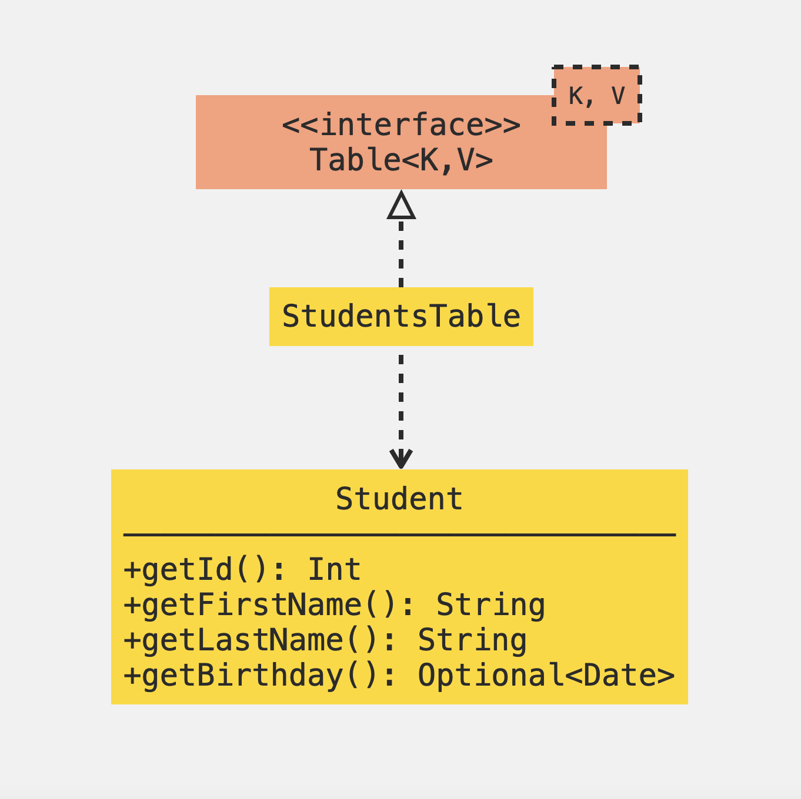

## Esercitazione di laboratorio su JDBC

---

L'obiettivo dell'esercitazione è prendere confidenza con l'API JDBC; vedremo come usare 
`DriverManager`, `Connection`, `Statement`, `PreparedStatement`, `ResultSet`.

---

## Setup
- Forkare il [repository dell'esercitazione](https://github.com/giacomocavalieri/labDB)
- Clonare il repo forkato
- Aprire il progetto in Eclipse
- Creare il database `"labjdbc"` su MySQL

---

## Modello dei dati

 <!-- .element: class="fit" height="400" -->

---

La tabella per questa entità sarà:
```sql[1,2|1-3|1-4|]
CREATE TABLE students (
    id INT NOT NULL PRIMARY KEY,
    firstName CHAR(40) NOT NULL,
    lastName CHAR(40) NOT NULL,
    birthday DATE
)
```

---

Per modellare lo stesso concetto di studente in Java possiamo definire una classe `Student`
con gli stessi campi descritti nel modello ER:
```java[1,2|1-3|1-4|1-6|]
public class Student {
    private final int id;
    private final String firstName;
    private final String lastName;
    private final Optional<Date> birthday;
    // Perché birthday è Optional?
    
    // costruttore, getter...
}
```

---

## Modellazione in Java

 <!-- .element: class="fit" height="400" -->

---

`Table<K, V>` è un'interfaccia che rappresenta la tabella di un DB dalla quale 
si potranno recuperare oggetti di tipo `V`, con chiave primaria di tipo `K`

```java[1-3|1-4|1-5|1-6|1-7|1-8|1-9|]
// Una tabella che contiene entità di tipo V
// che hanno chiave primaria di tipo K
public interface Table<V,K> {
    boolean createTable(); // CREATE TABLE
    boolean dropTable();   // DROP TABLE
    Optional<V> findByPrimaryKey(final K primaryKey); // SELECT
    List<V> findAll();
    boolean save(final V value);          // INSERT INTO
    boolean update(final V updatedValue); // UPDATE
    boolean delete(final K primaryKey);   // DELETE FROM
}
```

La tabella che contiene i dati degli `Student` sarà una `Table<Student, Integer>`

---

### Creazione di una connessione

```java
final String dbUri = "jdbc:mysql://localhost:3306/<dbName>";
final String username = "root";
final String password = "";
final var connection =
    DriverManager.getConnection(dbUri, username, password);
```
